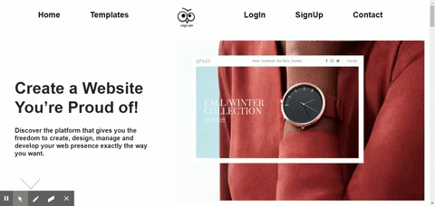
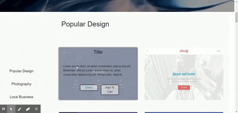

# LingoLabs

Project 3 link to google doc: https://docs.google.com/document/d/1PC3hDbZAKtkO0yVMF9RigVGS_r2frqgCYciixsEO4NY/edit#

Web Templates:

The goal of this project is to create a website where users can browse and shop pre-made websites templates.
Once a user arrives at the page, it will be displayed with navbar on top:
The left side of a navbar will contain the name/logo of our company
The right side will contain login/sign up links.
The rest of the page/main content will display features/services that will show websites ( once I create a landing page, I will list the right amount of features, but for this project, we will utilize only a few of them.)

To be able to access all that our websites have to offer/browse/buy web templates, the user must create an account:
Users must enter first/last name & password( we can play around with this functionality and decide what’s the easiest way)

Once the user has created a profile, it will be redirected to another page -> instead of the logo in the navbar, it will be replaced with users first name, while login and sign up links will be replaced with log out button and cart icon.
The left side panel of the main content page will contain animated buttons that hide and more ap on hover. These buttons will be for searching the template user is looking for example:
Professional Portfolio
Company website
Workout website
Responsive websites
E-commerce websites
Corporate websites etc...

For this project, I will have one or two of each web templates live, and I will have dummy templates that will not be available( once the user clicks on them, it will give an error SOLD OUT!)

I will hard code HTML templates and make them live so that the user can browse and get a feeling of how the model looks.

Once the user clicks one of the sorting buttons, a new page will be open with all the templates that we offer( again, it will be only one or two which will be live and rest will be dummy templates to populate the page, if the user clicks on the dummy template it will get an error)
Once the user hovers the template image, it will display the name of a model. Once the user clicks on a web template, it will open a modal that will be placed in the middle of the screen:
the left side of modal will contain the same template image
under the image, it will provide a link for live demo/preview
on the right side of the modal, it will be price, template description, and add to cart link.
Once the user click adds to cart, it will grab a web template with image, price, template description, and insert it inside the cart.

Functions that can be added if there is time:
Premium web templates
Existing templates that can be tailored based on clients wishes
live chat for more accessible communication with the client

Again more functions can be added or removed based on the time and effort we put towards this project. Feel free to add/remove functionalities if you have a better idea.

Peace :)

Niko
